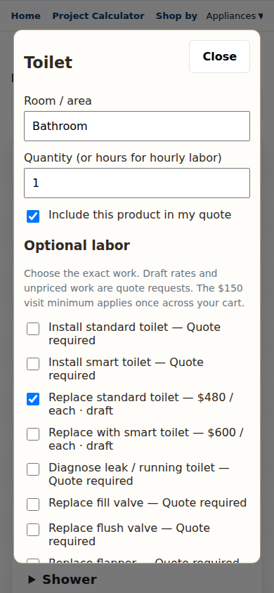
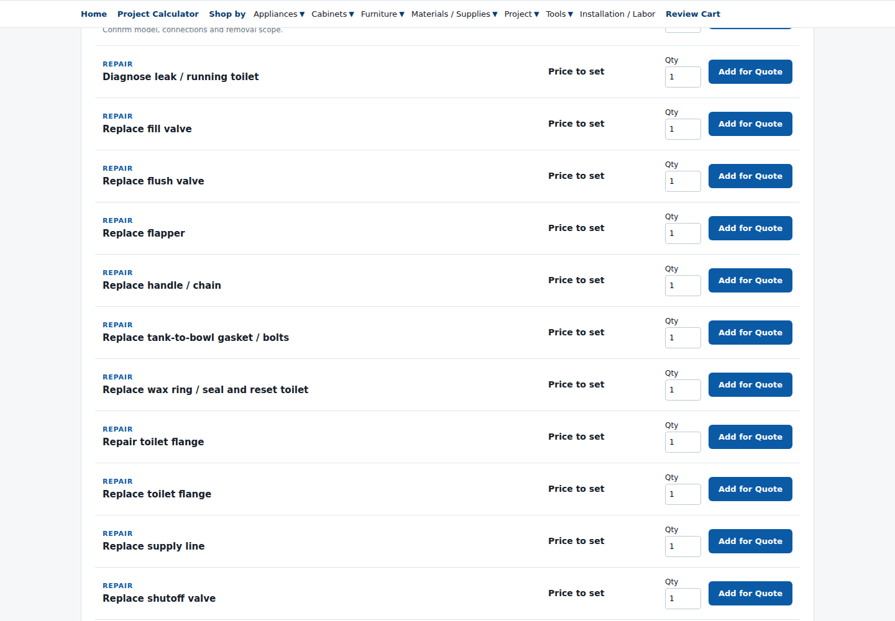

# Integrated project flow review

This branch is a review build. It is not a production release.

Shopping and custom project cards open a room/item/task editor. Measured work opens the existing calculator in a dialog. Saving measured work updates the cart; repeat saves update the same work. Cart editing restores saved measurements. Removing a measured work item removes its associated materials, services and supplies together.

The long Installation / Labor list and shopping editor use `labor-catalog.js`. Approved appliance rates retain their task scopes. Bathroom replacement proposals remain draft quote requests. Toilet installation has no assumed price. Supplies are opt-in. Materials without supplier prices remain quote requests, not zero-dollar products. The service minimum remains $150 once across the visit.

Validation: four Node regression tests, JavaScript syntax checks, production build, and Chromium browser checks at 390px and 1440px. Browser checks covered dishwasher repeat saves, flooring dimensions and price updates, restoring/editing/removing saved work, toilet draft pricing, bathroom project entry, concrete volume, labor-only removal, and a single service minimum. No page JavaScript errors were recorded. External image requests were blocked in the test browser; existing image URLs and original logo assets were not modified.

Known review limits: supplier/material prices remain unavailable; unpriced repairs still require a quote. This is a representative flow check, not validation of every task or supplier product. Existing carts created before this branch are retained; ambiguous historical duplicate entries are not silently deleted.

